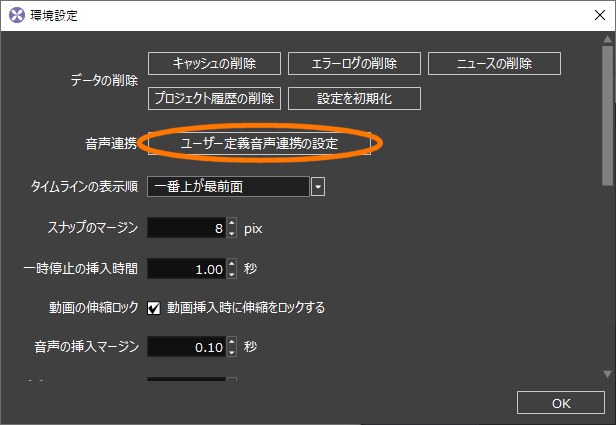
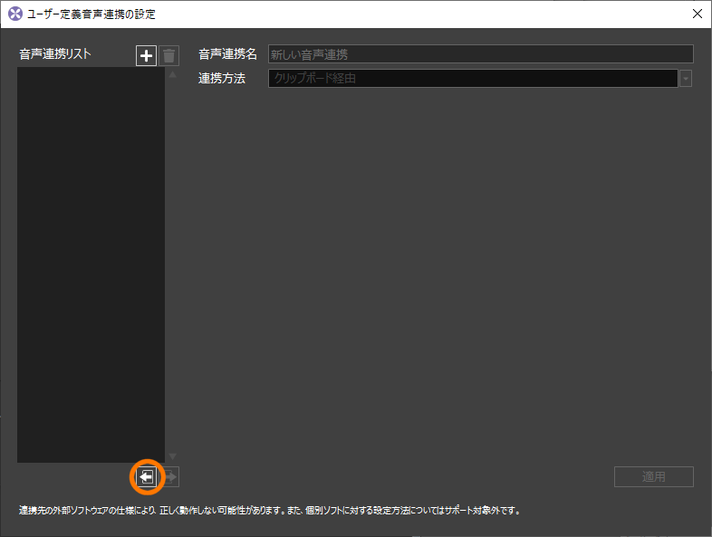
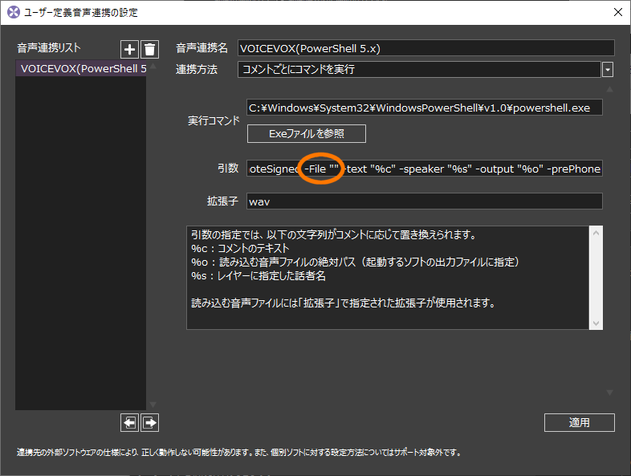
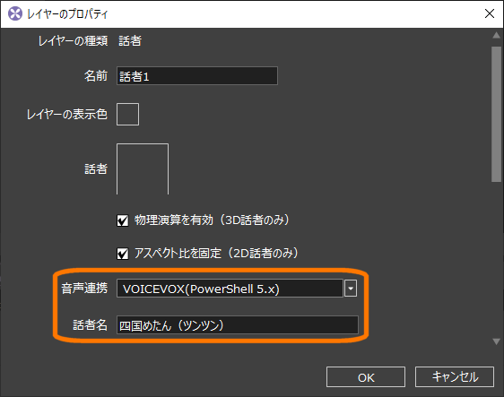

# voivoca

[VOICEVOX](https://voicevox.hiroshiba.jp/), [COEIROINK](https://coeiroink.com/)の音声合成エンジンを呼ぶためのWindows PowerShellスクリプトです。[Recotte Studioの「ユーザー定義音声機能」](https://youtu.be/dB5rDhiPMmQ)に使用できます

## 使用例

```ps1
> .\voivoca.ps1 -speaker "四国めたん(ツンツン)" -text "わたくしは漆黒のめたんですわ" -output shikkoku.wav
```
※PowerShellの詳しい使い方についてはここでは説明しません

**目次**
* TOC
{:toc}

## Recotte Studioの「ユーザー定義音声機能」での使い方

### インストール手順

1. [Releaseページ](https://github.com/so-c/soc-toolbox/releases)から`voivoca-vX.Y.Z.zip`をダウンロードして好きなフォルダに展開する
1. インストールしたフォルダにある`create-rvls.bat`をダブルクリックし、設定ファイル`VOICEVOX(PowerShell 5.1).rvls`を作成する。「WindowsによってPCが保護されました」と警告が出た場合は[詳細] > [実行] と押してください
1. Recotte Studioの [環境設定 > ユーザー定義音声連携の設定] を開く<br>
<a href="../assets/images/recosta_settings.png"></a>
1. インポートボタンを押し、作成した`VOICEVOX(PowerShell 5.1).rvls`を選ぶ<br>
<a href="../assets/images/recosta_user_def.png"></a>

#### トラブルシュート

`create-rvls.bat`を押しても設定ファイルが作成されない場合、テンプレートファイルをインポートして設定を書き足してください

1. `template`フォルダ内の`VOICEVOX(PowerShell 5.1).rvls.org`の名前を`VOICEVOX(PowerShell 5.1).rvls`に変更する
1. Recotte Studioにインポートする（方法は設定ファイルと同じ）
1. [引数] 欄の-File ""のダブルクオーテーション内に、インストールしたフォルダにあるvoivoca.ps1へのフルパスを書き足す<br>
<a href="../assets/images/recosta_args.png"></a>
```ps1
# [引数] 欄の例
-ExecutionPolicy Bypass -File "C:\Users\YourName\Documents\voivoca\voivoca.ps1" -text "%c" -speaker "%s" -output "%o"
```

### 使用準備

1. 話者レイヤーを追加してプロパティーを開く
1. [話者名] (≠名前) をキャラクター名で始まるように設定する
   * スタイルがあるキャラクタは「四国めたん(ツンツン)」のように指定できます
   
1. [音声連携] でインストールした"VOICEVOX(PoerShell 5.1)" を選ぶ
1. [OK] ボタンを押す<br>
<a href="../assets/images/recosta_speaker_layer.png"></a>

### 使用方法

VOICEVOX, COEIROINKを起動した状態で [音声の同期] をしてください。

### 話者・スタイル一覧

<table>
<tr>
<th style="text-align: center;" colspan="4">VOICEVOX</th>
</tr>
<tr>
    <td>四国めたん</td>
    <td>ずんだもん</td>
    <td>九州そら</td>
    <td></td>
</tr>
<tr>
    <td>春日部つむぎ</td>
    <td>雨晴はう</td>
    <td>波音リツ</td>
    <td></td>
</tr>
<tr>
    <td>玄野武宏</td>
    <td>白上虎太郎</td>
    <td>青山龍星</td>
    <td>冥鳴ひまり</td>
</tr>
<tr>
    <td>モチノ・キョウコ</td>
    <td>剣崎雌雄</td>
    <td></td>
    <td></td>
</tr>
<tr>
    <td>WhiteCUL</td>
    <td>後鬼</td>
    <td>No.7</td>
    <td></td>
</tr>
</table>

<table>
    <tr>
        <th style="text-align: center;" colspan="3">COEIROINK</th>
    </tr>
    <tr>
        <td>つくよみちゃん</td>
        <td>おふとんP</td>
        <td></td>
    </tr>
    <tr>
        <td>MANA</td>
        <td>MANA+</td>
        <td>KANA</td>
    </tr>
    <tr>
        <td>ディアちゃん</td>
        <td>アルマちゃん</td>
        <td></td>
    </tr>
    <tr>
        <td>AI声優-朱花</td>
        <td>AI声優-青葉</td>
        <td>AI声優-銀芽</td>
    </tr>
</table>

<table>
    <tr>
        <th style="text-align: center;">話者名</th>
        <th style="text-align: center;" colspan="6">スタイル</th>
    </tr>
    <tr>
        <td>四国めたん</td>
        <td>ノーマル</td>
        <td>あまあま</td>
        <td>ツンツン</td>
        <td>セクシー</td>
        <td></td>
        <td></td>
    </tr>
    <tr>
        <td>ずんだもん</td>
        <td>ノーマル</td>
        <td>あまあま</td>
        <td>ツンツン</td>
        <td>セクシー</td>
        <td>ささやき</td>
        <td></td>
    </tr>
    <tr>
        <td>九州そら</td>
        <td>ノーマル</td>
        <td>あまあま</td>
        <td>ツンツン</td>
        <td>セクシー</td>
        <td>ささやき</td>
        <td></td>
    </tr>
    <tr>
        <td>白上虎太郎</td>
        <td>ふつう</td>
        <td>わーい</td>
        <td>おこ</td>
        <td>びくびく</td>
        <td>びえーん</td>
        <td></td>
    </tr>
        <tr>
        <td>WhiteCUL</td>
        <td>ノーマル</td>
        <td>たのしい</td>
        <td>かなしい</td>
        <td>びえーん</td>
        <td></td>
        <td></td>
    </tr>
    <tr>
        <td>後鬼</td>
        <td>人間ver.</td>
        <td>ぬいぐるみver.</td>
        <td></td>
        <td></td>
        <td></td>
        <td></td>
    </tr>
    <tr>
        <td>No.7</td>
        <td>ノーマル</td>
        <td>アナウンス</td>
        <td>読み聞かせ</td>
        <td></td>
        <td></td>
        <td></td>
    </tr>
    <tr>
        <td>つくよみちゃん</td>
        <td>おしとやか</td>
        <td>れいせい</td>
        <td>げんき</td>
        <td></td>
        <td></td>
        <td></td>
    </tr>
    <tr>
        <td>MANA</td>
        <td>のーまる</td>
        <td>いっしょうけんめい</td>
        <td>ごきげん</td>
        <td></td>
        <td></td>
        <td></td>
    </tr>
    <tr>
        <td>MANA+</td>
        <td>ふくれっつら</td>
        <td>しょんぼり</td>
        <td></td>
        <td></td>
        <td></td>
        <td></td>
    </tr>
    <tr>
        <td>KANA</td>
        <td>のーまる</td>
        <td>えんげき</td>
        <td></td>
        <td></td>
        <td></td>
        <td></td>
    </tr>
    <tr>
        <td>おふとんP</td>
        <td>のーまるv2</td>
        <td>よろこび</td>
        <td>かなしみ</td>
        <td>あせり</td>
        <td>ささやき</td>
        <td>ナレーション</td>
    </tr>
    <tr>
        <td>アルマちゃん</td>
        <td>表-v1</td>
        <td>表-v2</td>
        <td>裏</td>
        <td></td>
        <td></td>
        <td></td>
    </tr>
</table>

### 参考動画
<script type="application/javascript" src="https://embed.nicovideo.jp/watch/sm39404090/script?w=720&h=480"></script><noscript><a href="https://www.nicovideo.jp/watch/sm39404090">【2分で教えてついなちゃん♡】レコスタのユーザ定義音声連携でA.I.VOICEやVOICEVOX【Recotte Studio】</a></noscript>

[YouTubeはこちら](https://www.youtube.com/watch?v=N_VCF2ABKA8)

### TIPS

* 音声が作成されない場合は`voivoca.ps1`と同じフォルダの`last_error.txt`を確認してみてください。最後に発生したエラーが出力されています
* このスクリプトはWindowsに最初からインストールされてるWindows PowerShell ISEで変更・動作確認できます。好みに合わせてカスタマイズしてください

#### 利用できる引数

##### 必須引数

| 引数名 | 説明 |
|:--|:--|
|spekaer|キャラクター名（感情）|
|text|喋らせたいテキスト|
|out|出力ファイル名|

##### オプション引数

| 引数名 | 説明 | デフォルト値 |
|:--|:--|:--:|
|speedScale|話速|1.0|
|pitchScale|音高|0.1|
|intonationScale|抑揚|1.0|
|volumeScale|音量|1.0|
|prePhonemeLength|開始無音|0.1|
|postPhonemeLength|終了無音|0.1|
|outputSamplingRate|音声のサンプリングレート|48000 (48kHz)|
|outputStereo|音声をステレオ化|false|

### 利用規約

* ユーザ向け
  * 本スクリプトはインターネット全般で非商用・商用問わず利用できます
  * Recotte StudioやVOICEVOX、各キャラクターの利用規約に従ってください
  * ニコニコ動画で使う際はニコニ･コモンズの [voivoca](https://commons.nicovideo.jp/material/nc252957) のコンテンツツリー登録にご協力ください
* 開発者向け
  * スクリプト本体は[MIT License](https://github.com/so-c/soc-toolbox/blob/main/LICENSE)です
